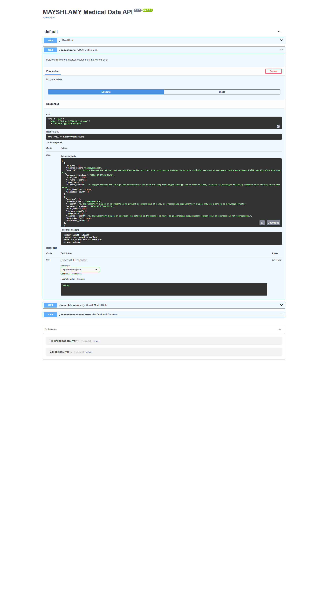
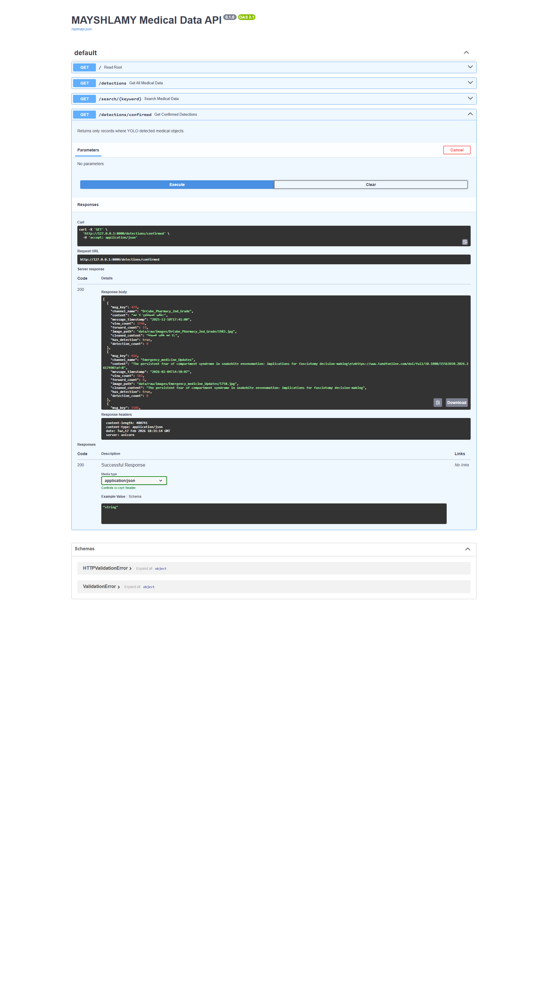
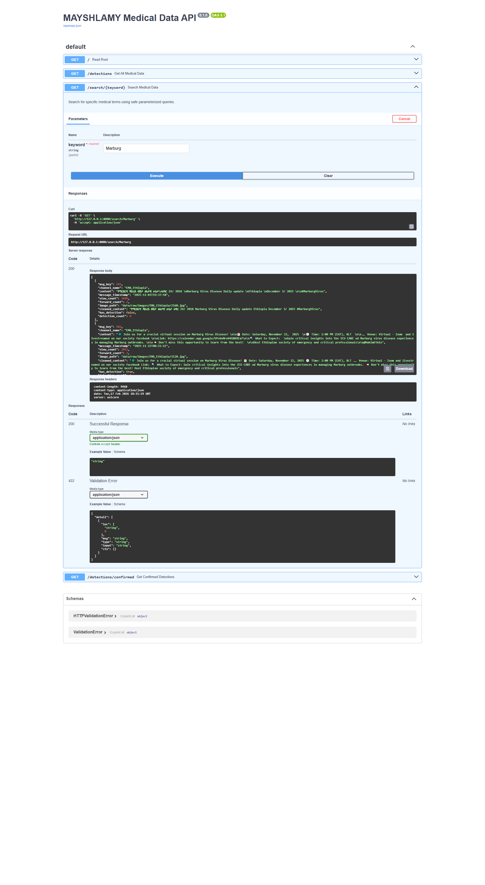

# 🏥 Medical Data Warehouse: Telegram to API Pipeline

**Author:** Mikiyas Dawit Abera  
**Project Type:** Data Engineering & AI Integration  
**Stack:** Python, PostgreSQL, FastAPI, YOLOv8, dbt, Playwright

## 📌 Project Overview
This project is a comprehensive data pipeline that extracts medical information from Amharic and English Telegram channels, cleans the data, runs AI object detection on associated images, and serves the refined data through a robust FastAPI backend.

The goal is to provide a searchable, structured "Warehouse" for medical updates, specifically focusing on Ethiopian public health data like Marburg Virus updates and pharmaceutical information.

---

## 🏗️ System Architecture

1.  **Ingestion:** Telegram Scraper extracts raw messages and images.
2.  **Transformation (dbt):** Raw data is staged in PostgreSQL and structured using dbt.
3.  **Refinement (Python):** * **Cleaning:** Removes emojis, ads, and irrelevant football/news content.
    * **AI Logic:** Uses **YOLOv8** to detect medical objects in images.
4.  **Serving:** A **FastAPI** interface allows users to query the warehouse via keywords or detection status.

---

## 🚀 API Features & Documentation

The API is fully documented with Swagger UI and supports multilingual search (English & Amharic).

### 1. Global Data Access
Fetches all processed medical records, including cleaned text and detection flags.


### 2. YOLO Confirmed Detections
Filters the warehouse to return only records where the AI successfully identified medical equipment or medicine.


### 3. Smart Keyword Search
Supports case-insensitive search and partial matches for medical terms.
**Example:** Searching for *"Marburg"* returns all daily virus updates.


---

## 🛠️ Technical Implementation

### Data Cleaning
Standardized cleaning logic to ensure high-quality text for downstream analysis:
```python
def clean_text(text):
    # Removes URLs, emojis, and non-medical noise
    # Standardizes Amharic and English scripts
    ...

```

### Database Protection

The API utilizes **SQLAlchemy Parameterized Queries** to prevent SQL injection attacks:

```python
query = text("SELECT * FROM refined.medical_data WHERE cleaned_content ILIKE :key")
df = pd.read_sql(query, engine, params={"key": f"%{keyword}%"})

```

### Automated Documentation

The screenshots above were generated using an automated **Playwright** script that executes live API calls and captures the full-page response.

---

## 📁 Folder Structure

```text
.
├── api/                # FastAPI application logic
├── src/                # Cleaning & YOLO detection scripts
├── models/             # dbt models for SQL transformation
├── assets/             # Automated API documentation screenshots
├── .env                # Database credentials (hidden)
└── main.py             # Entry point for the API

```

## ⚙️ Setup & Installation

1. Clone the repository.
2. Install dependencies: `pip install -r requirements.txt`
3. Configure your `.env` with PostgreSQL credentials.
4. Run the API: `uvicorn api.main:app --reload`
5. Access docs at: `http://127.0.0.1:8000/docs`
